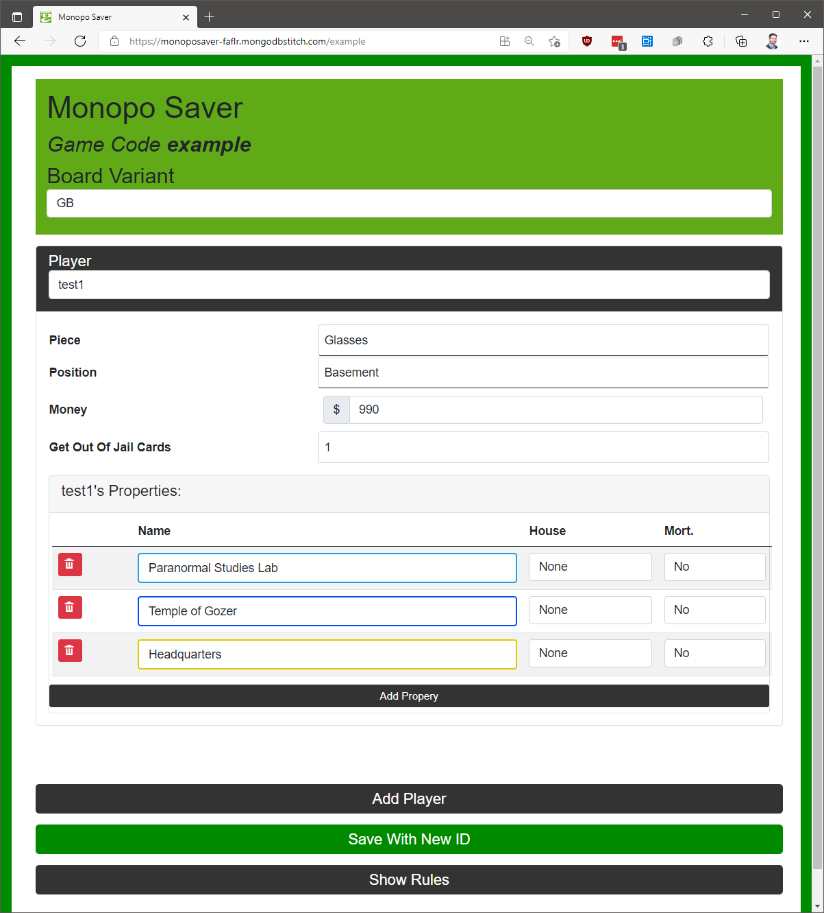

# Monopo Saver

## Background
This is a simple website that will save track your Monopoly game details so you can restart later.

Each time you save, you are given a new immutable ID and link so you can send it to the friends you are playing with to insure there's no cheating going on.

Right now it stores the [Ghostbuster's Monopoly](https://hasbrogaming.hasbro.com/en-us/product/monopoly-game-ghostbusters-edition-for-kids-8-and-up:0CBDEDEA-AF56-46D5-8C0C-63E4428E64D2) and [New Monopoly](https://hasbrogaming.hasbro.com/en-us/product/monopoly-game:7EABAF97-5056-9047-F577-8F4663C79E75) places. It is written to support multiple Monopoly board types, I just need to do data entry on those.

It is offered as a service free [here](https://monoposaver-faflr.mongodbstitch.com).

## Screenshots

## Tech Stack
* Single Page App written in Blazor
* Database is MongoDB Atlas
* Backend is MongoDB Realm App Services